# Lab3 Serverless: 可观测性
在本次实验中，您将通过Cloud9创建一个serverless样例应用，包含API Gateway, Lambda, DynamoDB, SNS等服务。

## 部署样例应用

### 下载样例应用代码

```
cd ~/environment
git clone https://github.com/aws-samples/serverless-observability-workshop.git

```

### 安装环境，打包部署样例应用
```
cd ~/environment/serverless-observability-workshop/code/sample-app-tracing
npm install
sam build
sam deploy -g
```

### 命令行对话框中输入参数
空行直接回车保留默认值
```
        Setting default arguments for 'sam deploy'
        =========================================
        Stack Name [sam-app]: monitoring-app-tracing
        AWS Region [us-west-2]: us-west-2
        #Shows you resources changes to be deployed and require a 'Y' to initiate deploy
        Confirm changes before deploy [y/N]: Y
        #SAM needs permission to be able to create roles to connect to the resources in your template
        Allow SAM CLI IAM role creation [Y/n]: Y
        getAllItemsFunction may not have authorization defined, Is this okay? [y/N]: Y
        getByIdFunction may not have authorization defined, Is this okay? [y/N]: Y
        putItemFunction may not have authorization defined, Is this okay? [y/N]: Y
        Save arguments to samconfig.toml [Y/n]: Y 
```

### 确认应用部署状态
打开Cloudformation，找到名为monitoring-app-tracing的stack

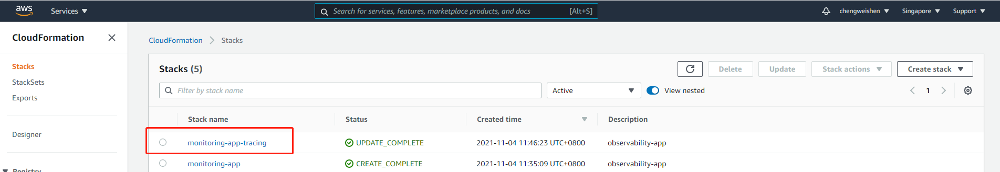

等待一段时间后，点击stack名称查看详情(stack状态应为“CREATE_COMPLETE”)

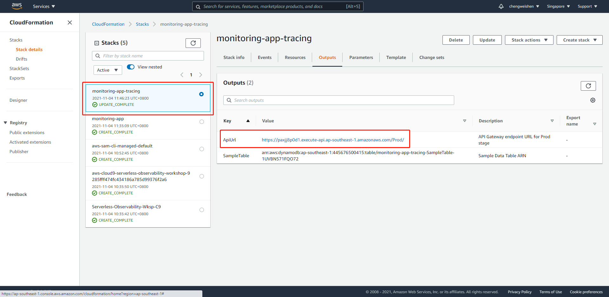

## 测试样例应用

### 获取应用URL
```
export ApiUrl=$(aws cloudformation describe-stacks --stack-name monitoring-app-tracing --output json | jq '.Stacks[].Outputs[] | select(.OutputKey=="ApiUrl") | .OutputValue' | sed -e 's/^"//'  -e 's/"$//')
echo "export ApiUrl="$ApiUrl
```

### 测试 Put Item接口
```
curl -X POST \
  $ApiUrl/items/ \
  -d '{
        "id":"1",  
        "name": "Sample test item"
  }'

curl -X POST \
  $ApiUrl/items/ \
  -d '{
        "id":"2",  
        "name": "Second test item"
  }'
```

### 测试 Get All Items 接口
```
curl -X GET $ApiUrl/items/ | jq
```

### 测试 Get Item by Id 接口
```
curl -X GET $ApiUrl/items/1 | jq
```

# 启用X-Ray Active Tracing
在本章节中，您对已部署的serverless样例应用进行修改，使应用所使用的到API Gateway和Lambda函数都启用X-Ray Active Tracing功能

## 修改SAM 模板文件
这一步将在SAM模板中对lambda函数和API Gateway添加Active Tracing相关的配置

### 进入应用代码目录
```
cd ~/environment/serverless-observability-workshop/code/sample-app-tracing
```

### 修改template.yaml
找到Globals区块下的对应位置，添加三处配置（以下配置中带# <----- ADD FOR XXXX的行，确保文件缩进准确）
```
Globals:
  Function:
    Runtime: nodejs12.x
    Timeout: 100
    Tracing: Active # <----- ADD FOR LAMBDA
    MemorySize: 128
    CodeUri: ./
    Environment:
      Variables:
        APP_NAME: !Ref SampleTable
        SAMPLE_TABLE: !Ref SampleTable
        SERVICE_NAME: item_service
        ENABLE_DEBUG: false
        # Enable usage of KeepAlive to reduce overhead of short-lived actions, like DynamoDB queries
        AWS_NODEJS_CONNECTION_REUSE_ENABLED: 1
  Api:                    # <----- ADD FOR API
    TracingEnabled: true  # <----- ADD FOR API  

```

## 部署修改后的应用

```
cd ~/environment/serverless-observability-workshop/code/sample-app-tracing
sam build
sam deploy
```

## 测试启用了X-Ray Active Tracing后的接口

### 导出应用URL

```
export ApiUrl=$(aws cloudformation describe-stacks --stack-name monitoring-app-tracing --output json | jq '.Stacks[].Outputs[] | select(.OutputKey=="ApiUrl") | .OutputValue' | sed -e 's/^"//'  -e 's/"$//')
echo "export ApiUrl="$ApiUrl
```

测试Get All Items接口
```
curl -X GET $ApiUrl/items/ | jq
```

### 确认结果
可以看到应用的调用链为Client -> API Gateway -> Lambda<br>
点击任何一个节点，都能查看到相关的数据


# AWS SDK调用跟踪
在这个章节中，您将通过很少的代码修改，启用跟AWS SDK调用相关的跟踪。

## 修改应用代码

```
~/environment/serverless-observability-workshop/code/sample-app-tracing/src/handlers/put-item.js
~/environment/serverless-observability-workshop/code/sample-app-tracing/src/handlers/get-all-items.js
~/environment/serverless-observability-workshop/code/sample-app-tracing/src/handlers/get-by-id.js
~/environment/serverless-observability-workshop/code/sample-app-tracing/src/handlers/notify-item.js
```
将以下代码插入到上述4个文件的最起始行， 代码中如有const AWS = require('aws-sdk')，请注释掉。
```
const AWSXRay = require('aws-xray-sdk-core')
const AWS = AWSXRay.captureAWS(require('aws-sdk'))
```

## 部署修改后的应用

```
cd ~/environment/serverless-observability-workshop/code/sample-app-tracing
sam build
sam deploy
```

## 测试启用了AWS SDK调用跟踪后的接口

### 导出应用URL

```
export ApiUrl=$(aws cloudformation describe-stacks --stack-name monitoring-app-tracing --output json | jq '.Stacks[].Outputs[] | select(.OutputKey=="ApiUrl") | .OutputValue' | sed -e 's/^"//'  -e 's/"$//')
echo "export ApiUrl="$ApiUrl
```

测试Put Item接口
```
curl -X POST \
  $ApiUrl/items/ \
  -d '{
        "id":"3",  
        "name": "Third test item"
  }'

curl -X POST \
  $ApiUrl/items/ \
  -d '{
        "id":"4",  
        "name": "Fourth test item"
  }'
```

测试Get All Items接口
```
curl -X GET $ApiUrl/items/ | jq
```

测试Get Item by Id接口
```
curl -X GET $ApiUrl/items/3 | jq
curl -X GET $ApiUrl/items/4 | jq
```

### 确认结果
进入控制台ServiceLens Service Map页面
可以看到调用链为Client -> API Gateway -> Lambda -> Other Downstream Services
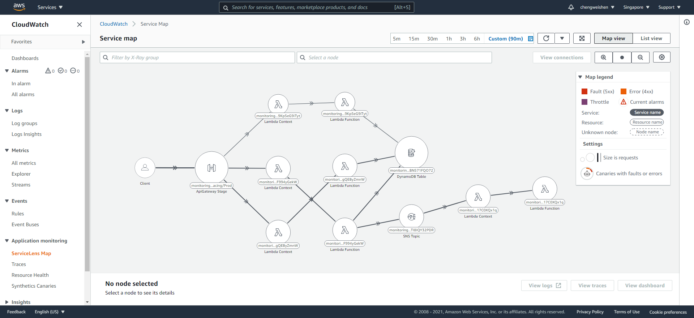

点击notifyNewItemFunction， 调用链最末尾<br>
点击View traces
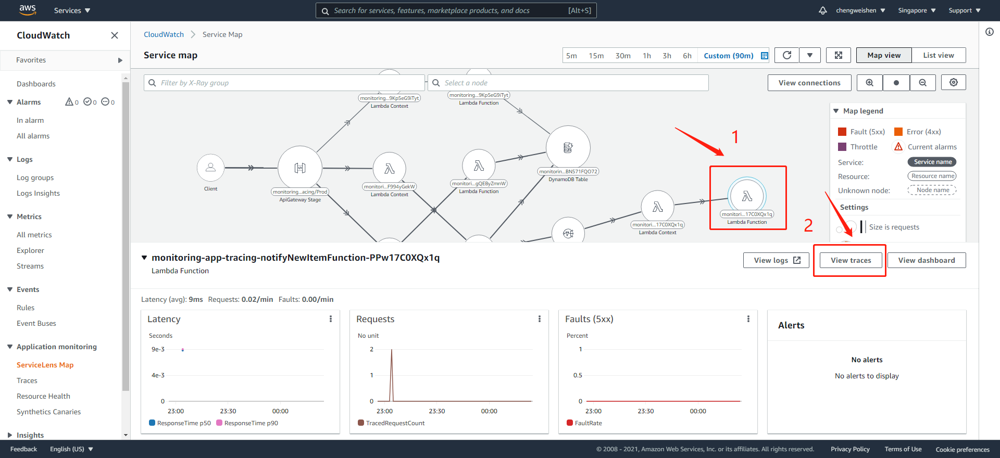

左侧里面可以按照不同的属性查看跟踪结果<br>
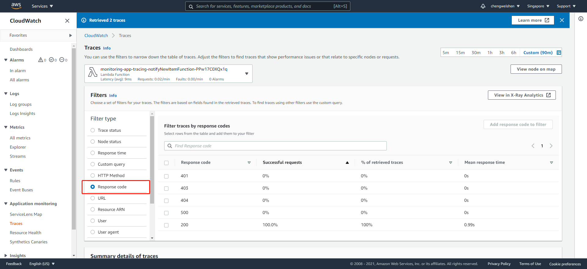

我们进一步寻找比较慢的请求记录
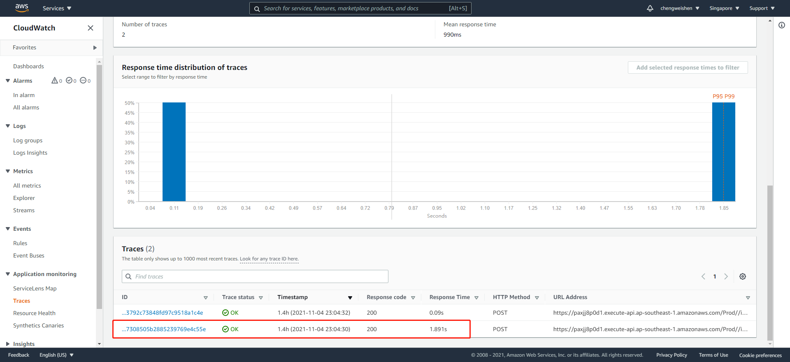

点击跟踪ID后可以查看该请求的整体跟踪链详情
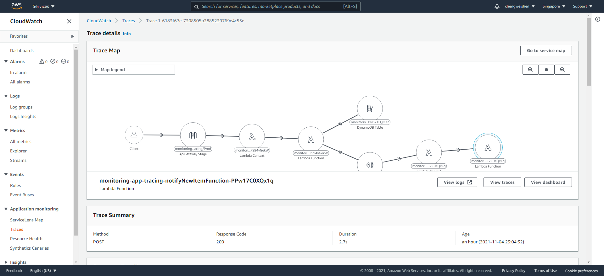

下拉可以看到每个节点的详细情况，DynamoDB 和 SNS等AWS SDK的调用情况也可以清晰看到
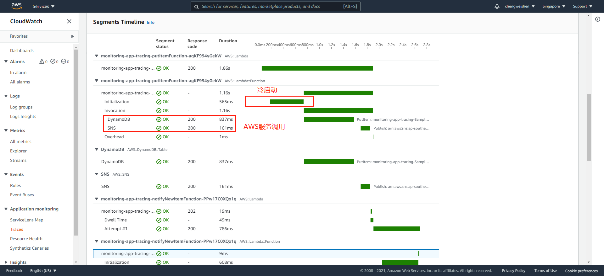

# Cloudwatch内置的Metric查看
在Cloudwatch->Metric页面，可以根据lambda函数的名称搜索需要查询的指标
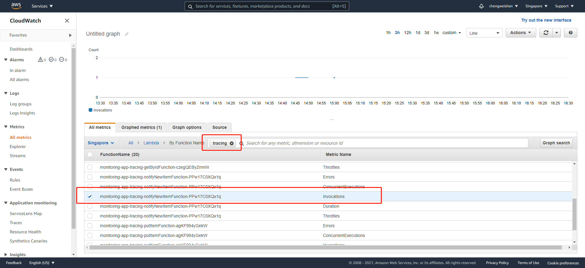

# Cloudwatch内置的Log查看

## 日志组
在Cloudwatch->Logs->Logs group页面，每个lambda函数都会生成一个日志组，里面记录了所有的日志信息

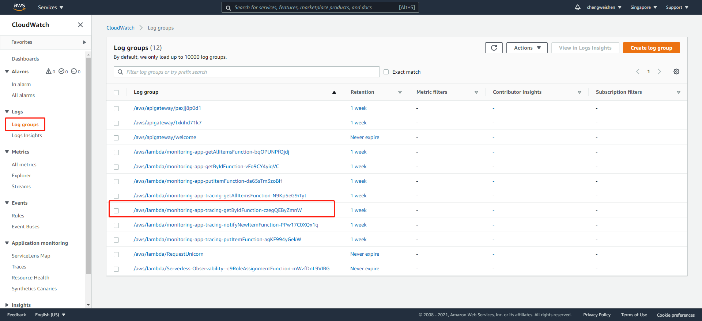

点击组名ID可以查看详细日志流，再次点击，可以查看到每条日志
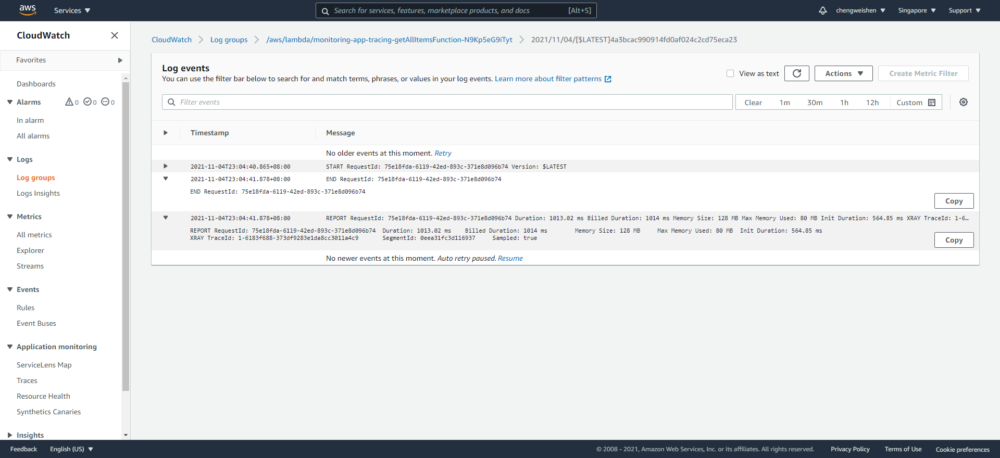

## 日志搜索和查询
在Cloudwatch->Logs->Logs Insights页面，可以在选择对应的日志组后通过Logs Insights语法进行查询
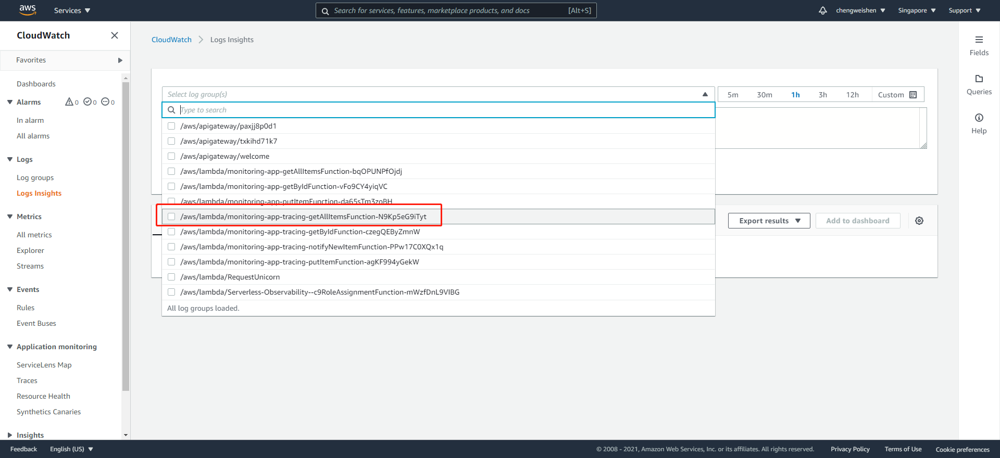
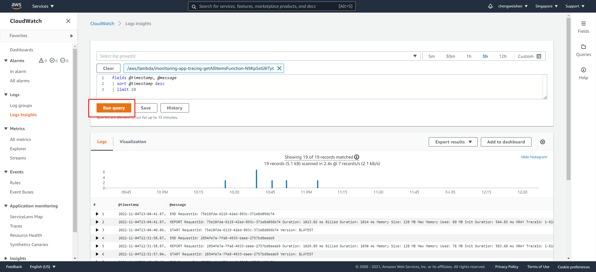